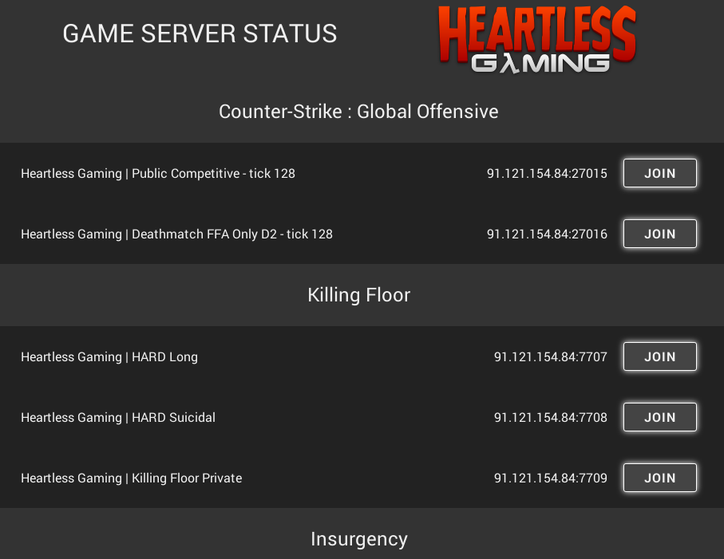

# Heartless Gaming Game Server Status
Code behind the [Heartless Gaming game server status](https://www.heartlessgaming.com/game-server-status/) website.

## What it do and how it's done
Simple crapy piece of php code that fetch a json object taken directly from a steamapi call and compare it to the heartless gaming server. Read more about the process of getting your server information on the [Allied Mods forum](https://forums.alliedmods.net/showthread.php?t=192367).

## TODO
	- Arrow to deploy the gameserver instance
	- align the game title to the left
	- Add image or art about the game
	- Add a liscence to the code of this project
	- Think about the liscence of the heartlessgaming asset.

## Dependencies
You need to install Composer in order to get the SteamCondenser Project in your vendor folder.

## Credit
Valve because their games and tools are awesome.

The people responsible for the PHP langage.

The contributors of the SteamCondenser project that make querying a source engine game server super easy.
